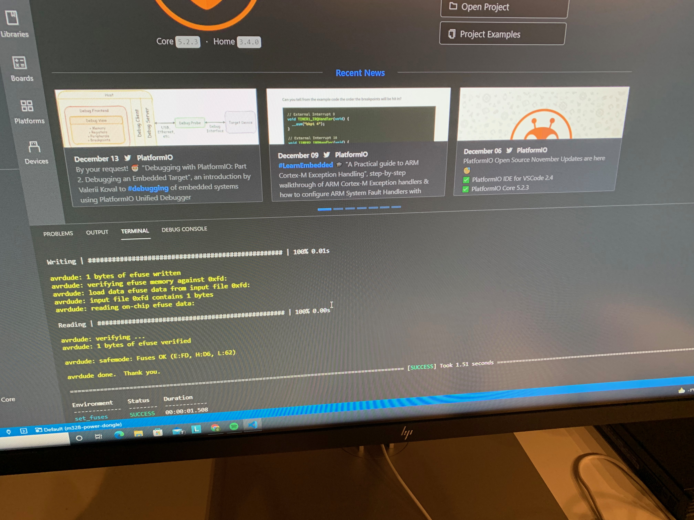

# bricked-avr
Did you have a small accident with writing the incorrect fuse settings to your AVR based Arduino?  And you did you roll your own PCB which depends solely on the internal clock and has no provisions for an external crystal?  Which means you are now unable to reflash new firmware and/or fuse settings?

Have no fear, this is a pretty common scenario and the solution is usually that you have to hook up/solder on a crystal with supporting capacitors to the XTAL pins of the microcontroller to fix this.  Given the pitch on those pins, this task can be a bit of a challenge.

I recently purchased a PCBite kit which features probes with pogo pins and PCB magnet holders, maybe this is a good setup to deal with the issue?  Turns out, it is!  Check out the images below on how to do this...  Worked like a charm!

https://www.batronix.com/shop/measurement/pcb-holder/sensepeek/4012-PCBite-kit-SP10-DMM.html

XTAL1 and XTAL2 pins must go to each side of the crystal, connect using the probes.  You also need to have 10-20pF capacitors on each side of the crystal to GND.  I had a ground pin available on the PCB which I brought out the the crystal/capacitors on the breadboard.

